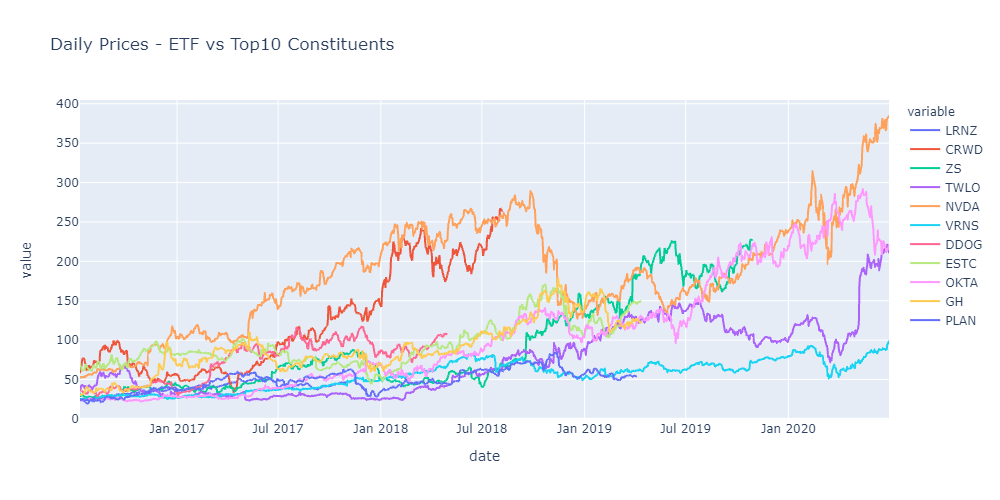
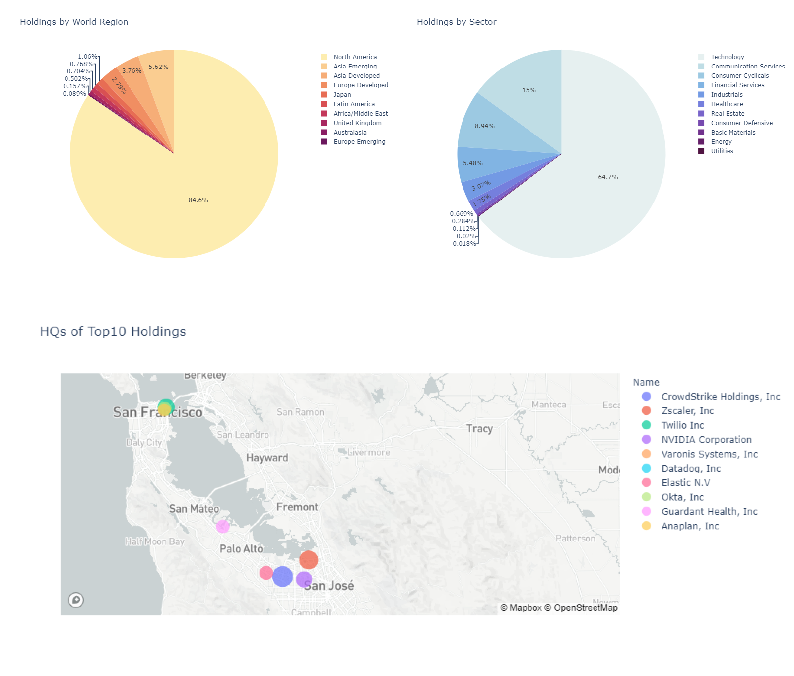

# Grandma & Grandpa's ETF

## Summary

*Grandma and Grandpa's ETF* is a project to help older, financially interested but technically challenged investors enter the modern investment landscape with confidence.  

Grandma and Grandpa's ETF is a **user-input based investment portfolio tool** that enables the user to visualise a personalised investment strategy based on an assessment of their specific interests, goals and needs.

The jupyter lab notebook we have developed sets out the steps for a user to input their investment preferences and execute code in a user friendly manner. By compiling various ETF's through an API we have given the user access to the latest trading information across a variety of industries. The final result is the allocation of an ETF based on their goals and a visual dashboard with varying performance metrics.   

## Background
Non-technical investors face significant barriers to entry in a rapidly moving investment market. The ability to access and utilise the latest financial information in a way that is catered to your particular needs would seem out of reach to most lay-people. 

A key trading strategy for novice investors is the use of exchange traded funds ([**ETF**](https://www.investopedia.com/terms/e/etf.asp)). ETF's enable users to diversify their risks and maintain a mix of stocks in a particualr industry that has tried and tested performances. 

Picking the right ETF can be tricky,  hence our model is designed to provide an end state performance dashboard using code and visualisations of financial data to simplify the process. The analysis looks at investments types and industries to create a risk profile, which in turn matches the user to a suitable ETF strategy.

## MVP
Initially it was proposed to build a tool that could assess multiple ETF's and provide summary statistics and results across various portfolios. Given the time restratints, this was beyond the scope and resources available. 

Our MVP as presented below focuses on one ETF output and capturing relevant risk information from the user, and defining the optimal ETF to match:

1. Capture user input data and generate users risk profile and investment preferences
2. Draw down API ETF information to provide a library of ETF products
3. Match the risk profile and investment preferences to the most suitable ETF
4. Create and calculate a summary of ETF data
5. Generate a dashboard to track the ETF performance and user's investment

-------------
 
## Stage One - Grandma & Grandpa's Inputs: Investment and Risk Profile

 To enable the allocationn of a personalised ETF, user inputs were created using widgets to allow for the selction of data and answering of specific fields.   

1. User interface and data capture:
Through the use of a series of questions with proportional weighting, we are able to capture the user's prevailing attitude to differing sectors and leanings to investment areas. Answers are based on a scale of importance that the user selects - "not important" to "very important"

2. Risk allocation:
A series of questions were then designed to determine the user's risk tolerance to various industries and invesment generally. The questions are designed to add or subtract a point(s) for the sector/risk to allow a total risk score to be determined.

---------------

## Stage Two - ETF API Queries and Allocation,
 
To provide an allocation, a large list of ETF's were Queried, cleansed and captured in two stages:

1. API sourcing and data extraction
Several APIs were limited by the number of data pulls per day, others charged money . In the end, FinQuant and [**EOD**](https://eodhistoricaldata.com/) were utilised to query the required data to build a portfolio of ETFs. Once tickers and intial data extracted, the team used called the Historical Prices and Fundamental Financial Data API, to extract further data for analysis.

2. API data cleansing and data frame merging: Grandma and Grandpa's ETF is designed to not only allocate risk and an appropriate ETF portfolio but show the user simple useable dashboard information to ensure their investment is meeting its objectives.
Hence key outputs must include:

    A. Return - Annual returns by ETF for past 5 years (looking back 5 years)

    B. Projected return - initial investment projected return (looking forward 5 years)

    C. Risk - expected return, volatility, sharpe ratio, Beta, Alpha etc

    D. Asset allocation - ticker, and portfolio weight (% share)

    E. Market health indicators - S&P 500 current state, etc

--------------

## Stage Three - Dashboard Performance Tracker

A dashboard is a summary for user to understand the past, current and future state of their investment. The allocated ETF is displayed via the dashboard and shows a variety of performance metrics so that the user may easily visualise the full spectrum analysis of their portfolio.

The dashboard shows the user:

A) Performance of ETF top 10 holdings

B) ETF holdings by Sector

C) ETF holding by Region

D) ETF returns over 10 years

E) Sunburst of Stock Data

F) ETF holding map data

